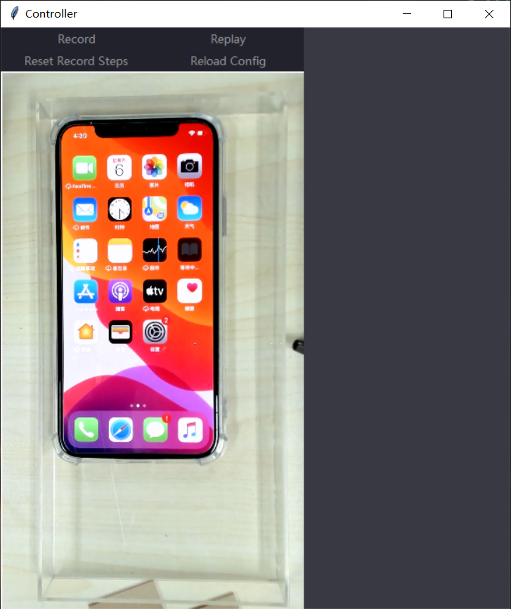
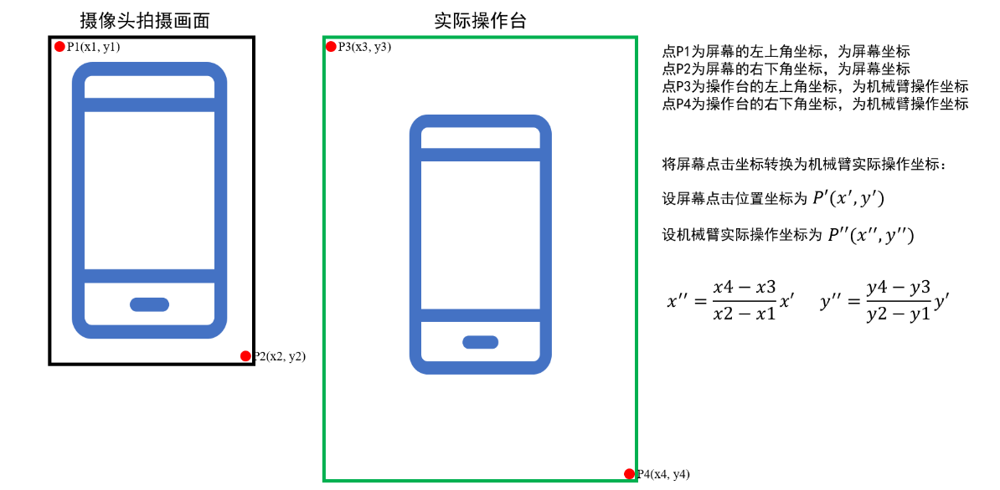

## Robot Controller

This is a framework designed as a GUI controller for uarm robot arms and internet cameras.

## Requirements

* python3

* other packages

```python

pip install logzero PIL threading opencv-python

```

## How to use

#### Run controller panel

```python
python3 camera_control_tk.py
```

After you run the script `camera_control_tk.py`, you will see the controller panel:




#### Buttons on the panel

* Record. The `Record` button can control the start and the end of your record. To start recording, just click this button once. After you start recording, your behaviors on the streaming panel will be recorded. To end record, you need to click this button again. After you end recording, the step information will be saved in the following format in `steps.json` file.

```json

{
  "steps": [
    {
      "action": "Click",
      "x": 254,
      "y": 580,
      "x_fix": 215, 
      "y_fix": 15,
      "screenshot_name": "step-1127102651.jpg" 
    }
  ]
}

```

**Note**: After you start recording, the screenshot of streaming panel will be saved each time you start an operation. 

* Replay. The `Replay` button is for guiding robot arms to replay the previously recorded steps. However, due to some disclosure issues, we don't have plans to open our replay code. You can try your own replay service with replacing the address of replay service at line 51 in file `utils.py`. The format of replaying request is listed in the following:

```json
{
  "figure1": base64_figure_1,
  "figure2": base64_figure_2,
}
```
The `figure1` is the recorded screenshot, and the `figure2` is the screenshot when replaying. **Note that both screenshots are encoded in BASE64 format.**

* Reset. Reset all recorded steps. This button is now **deprecated**.

* Reload Config. Reload the calibration configurations. 


#### Calibration

The calibration is for convert screen coordinates to robot arm operation coordinates. Specifically, there are four points which are important in calibration, P1, P2, P3 and P4. The P1(x1,y1) is the left top point in the screen and the P2(x2,y2) is the right bottom point in the screen. P3(x3,y3) is the left top point of the operation platform of robot arms. The P4(x4,y4) is the right bottom of the operation platfrom of robot arms.

The convertion of these coordinates can be described as:



In this controller, the above convertion is already implemnented. Therefore, if you want to do calibration, you should:

* get the above four points (P1, P2, P3 and P4)
* replace the coordinates in `config.json`. In this configuration file, the `left_top` corresponds to P3 , the `right_bottom` corresponds to P4, the `screen_left_top` corresponds to P1 and the `screen_right_bottom` corresponds to P2. The `height` in the configuration file means the operation height of robot arms. After you have input all coordinates, you can click "Reload Config" to reload the calibration.

**Note**: the `offset` is deprecated in `config.json`. Don't change it.

